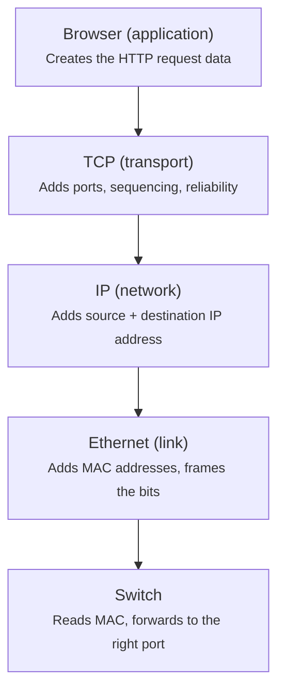

# Network stack: browser → switch

How a request travels down the stack. Each layer wraps the data from the layer above and adds its own header before passing it on — that wrapping is **encapsulation**.

## What each layer adds

| Layer | Adds | Purpose |
|-------|------|---------|
| **Browser** (application) | The HTTP request itself | The actual data you want to send |
| **TCP** (transport) | Source + destination **ports**, sequence numbers | Reliable, ordered delivery to the right program |
| **IP** (network) | Source + destination **IP address** | Routing across networks — the door out |
| **Ethernet** (link) | Source + destination **MAC address**, framing | Delivery on the local wire |
| **Switch** | — (reads, doesn't add) | Forwards the frame out the correct port |

## Encapsulation

Each step down wraps the previous one:

- Your HTTP data gets a **TCP header** →
- that whole thing gets an **IP header** →
- that gets an **Ethernet header**.

By the time it hits the wire it's a **frame** with three nested envelopes.

## What the switch does

The switch only cares about the outermost envelope — the **Ethernet/MAC** header. It reads the destination MAC and forwards the frame out the correct port, **without ever opening** the IP or TCP layers inside. Those get unwrapped later, layer by layer, at the receiving machine.

> Rule of thumb: switches work at the MAC layer (Layer 2), routers at the IP layer (Layer 3).